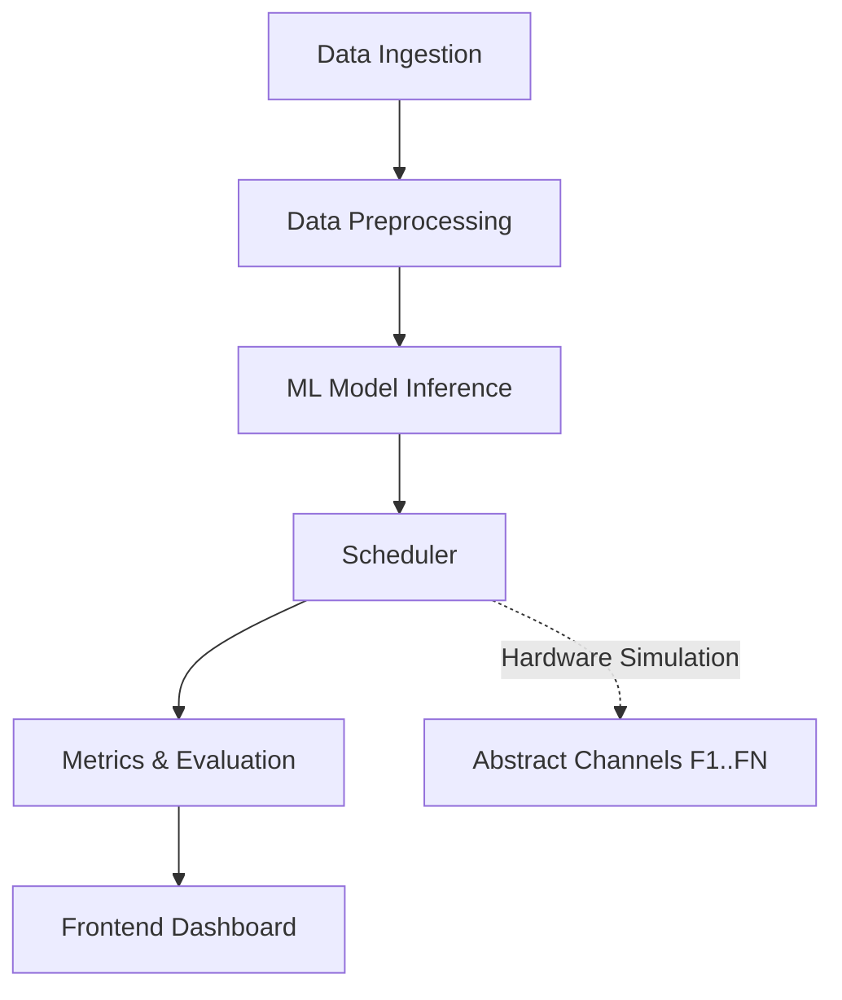

# SmartScan AI

## Overview
SmartScan AI is a software simulation platform developed for SIH 2026 Problem Statement 26055. It provides intelligent RF spectrum analysis and scheduling using machine learning models on realistic RF datasets.

## Architecture

## Installation
1. Clone the repository
2. Run `make install`
3. Configure environment variables (see `.env.example`)

## Usage
- Start the backend: `make backend`
- Start the frontend: `make frontend`
- Run the full suite: `docker-compose up`

## Safety Boundary Notice
This project is strictly a software simulation. It does **not** interface with, control, or directly modify any physical RF hardware. All channel operations operate on abstract, simulated channels designated F1..FN.

## Real RF Dataset Instructions
To ensure accurate models, you must provide a real RF dataset. Place your `.sigmf-meta` and `.sigmf-data` files into `data/raw/`. The pipeline will automatically preprocess these files into a usable parquet format.

## Scripts
- `main.py`: Entry point for backend API
- `train.py`: Model training script
- `preprocess.py`: RF data preprocessing script
- `evaluate.py`: Evaluation and metrics generation

## Research Metrics Definition
- **Detection Accuracy**: True positive rate of signal detection.
- **Scheduling Latency**: Time taken to allocate a channel.
- **Spectral Efficiency**: Overall throughput per bandwidth utilized.
